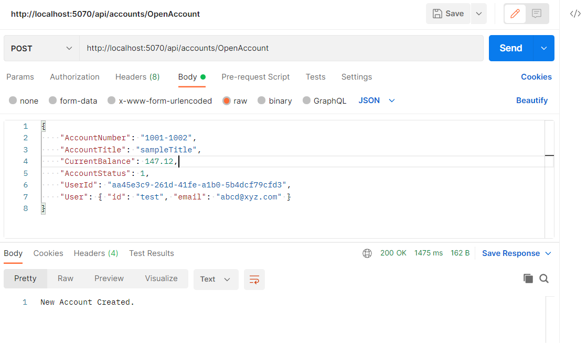
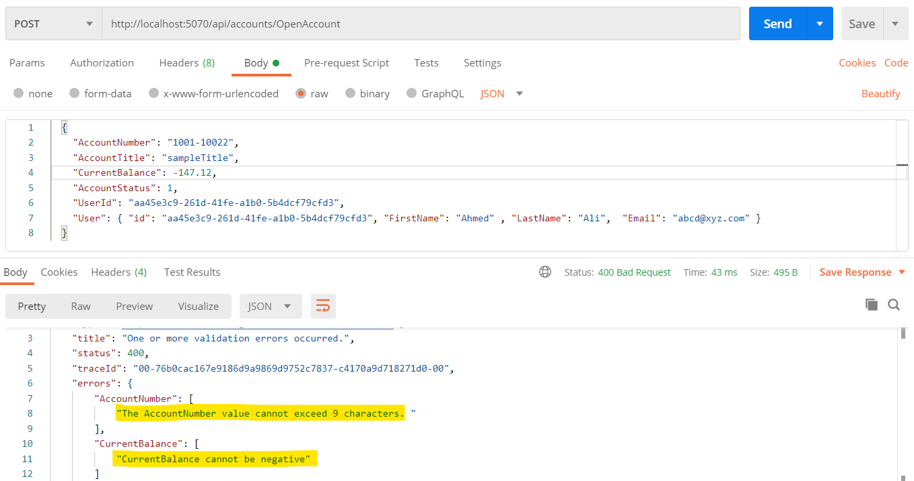

# **Server Side Validation with AutoMapper**

## **What Is Server Side Validation?**
Server-side validation indicates that any input sent by the user (or client) cannot be trusted. Server-side validation helps **prevent users from bypassing validation** by disabling or changing the client script. 

## **Server Side Validation in Asp.Net Core**
In Asp.Net Core, the server-side validation also known as **Model Validation**. Asp.Net Core validates the model with the constraints applied by validation attributes annotated on the top of each property of our model. These **validation attributes are known as Data Annotation**. The **ModelState** property checks whether the data is valid with respect to the annotation applied or not and ModelState.IsValid returns true if it's valid, false otherwise. 
We will see the implementation in this lab

**ModelState** is a property of a Controller instance, and can be accessed from any class that inherits from Controller Class. The ModelState has two purposes: to store and submit posted name-value pairs, and to store the validation errors associated with each value

The **Data Annotations** is a namespace that provides attribute classes, and these classes define metadata for controls for validation. Following is the list of built-in attributes 

## **Built-in attributes**
Here are some of the built-in validation attributes:

* **[ValidateNever]:** Indicates that a property or parameter should be excluded from validation.
* **[CreditCard]:** Validates that the property has a credit card format. Requires jQuery Validation Additional Methods.
* **[Compare]:** Validates that two properties in a model match.
* **[EmailAddress]:** Validates that the property has an email format.
* **[Phone]:** Validates that the property has a telephone number format.
* **[Range]:** Validates that the property value falls within a specified range.
* **[RegularExpression]:** Validates that the property value matches a specified regular expression.
* **[Required]:** Validates that the field isn't null. 
* **[StringLength]:** Validates that a string property value doesn't exceed a specified length limit.
* **[Url]:** Validates that the property has a URL format.
* **[Remote]:** Validates input on the client by calling an action method on the server. 
  
A complete list of validation attributes can be found in the `System.ComponentModel.DataAnnotations` namespace.

Click [here](https://docs.microsoft.com/en-us/aspnet/core/mvc/models/validation?view=aspnetcore-6.0) to learn more about these attributes in detail 

## **AutoMapper**
AutoMapper is a simple library that helps us to transform one object type to another. It is a convention-based object-to-object mapper that requires very little configuration. The object-to-object mapping works by transforming an input object of one type into an output object of a different type.

## **Case Study**
Consider a bank application where an admin has the access to open an account for a user. If we have only client-side validation applied in our form, the application can easily be breached with some simple tricks and tools and modify the sensitive information. Here the magic of server-side validation prevents us from such scenarios which validates the data first with the constraints set by the application. 

**Note:** To check the client-side validation lab click [here](https://github.com/PatternsTechGit/PT_AngularForms)

We will implement a server side validation using AutoMapper 

---------------

## About this exercise
In this lab we will be working on **Backend Codebase**. We will use **SOA lab** as a starting point for this lab.

## **Backend Codebase**
### Previously 
We developed a base structure of an API solution in asp.net core that have one controller which is `TransactionController`

* `TransactionController` have api functions `GetLast12MonthBalances` and `GetLast12MonthBalances/{userId}` which returns data for the last 12 months total balances.

There are 4 Projects in the solution. 

*	**Entities** : This project **contains DB models** like User where each User has one Account and each Account can have one or many Transactions. There is also a Response Model of LineGraphData that will be returned as API Response. 

*	**Infrastructure**: This project **contains BBBankContext** that service as fake DBContext that populates one User with its corresponding Account that has three Transactions dated of last three months with hardcoded data. 

* **Services**: This project **contains TransactionService** with the logic of converting Transactions into LineGraphData after fetching them from BBBankContext.

* **BBBankAPI**: This project **contains TransactionController** with 2 GET methods `GetLast12MonthBalances` & `GetLast12MonthBalances/{userId}` to call the TransactionService.


For more details about this base project See: https://github.com/PatternsTechGit/PT_ServiceOrientedArchitecture

-----------

We don't have implementations for frontend side for this lab,  we will only **use the Postman to make a HTTP request** to mock the open account request for the user and would see if model is validating the request or not .

To install the **postman** click [here](https://www.postman.com/downloads/) 

_____________

## **In this exercise**
In this lab we would perform following for **backend codebase**
* Create a **DTO for account request** 
* Add **data annotations** on the properties  
* Add [ValidateNever] annotation **on the Id Property of BaseEntity class** 
* Install **AutoMapper** from nuget package manager console
* Create a **mapping profile** 
* Add **mapper configuration** in the `Program.cs` file 
* Change the **account service and its contract w.r.t the DTO and AutoMapper**
* Change the **accounts controller w.r.t the DTO and Model Validation**
* **HTTP request to open an account** for a user

## **Backend Implementation**
Follow the below steps to implement backend code for Server Side validation with AutoMapper

## Step 1: **Create an Account Request DTO with Validations on the Properties**

 Create a new folder **RequestDTO** in the Entities project of the solution project. **Create a new file** `AccountRequestDTO.cs` inside this folder  which will acts as a DTO to open the account for a user. 
 
 ### **What is a DTO?**
A DTO (Data Transfer Object) **defines part or all of data defined by the underlying Domain object**. Note that data from different domain objects can be represented by using a single DTO, that's actually one of the major benefits for having DTO.

 The code for this DTO is given below.
 ```cs
    public class AccountRequestDTO
    {
        [MinLength(4, ErrorMessage = "The AccountNumber value cannot less than 4 characters. ")]
        [MaxLength(9, ErrorMessage = "The AccountNumber value cannot exceed 9 characters. ")]
        [Required(ErrorMessage = "AccountNumber is required.")]
        public string AccountNumber { get; set; }

        [MinLength(4, ErrorMessage = "The AccountTitle value cannot less than 4 characters.")]
        [MaxLength(20, ErrorMessage = "The AccountTitle value cannot exceed 20 characters. ")]
        [Required(ErrorMessage = "AccountTitle is required.")]
        public string AccountTitle { get; set; }
        
        [Required(ErrorMessage = "CurrentBalance is required.")]
        [Range(0, double.MaxValue, ErrorMessage = "CurrentBalance cannot be negative")]
        public decimal CurrentBalance { get; set; }
        
        [Required(ErrorMessage = "AccountStatus is required.")]
        public AccountStatus AccountStatus { get; set; }
        
        [Required(ErrorMessage = "UserId is required.")]
        public string UserId { get; set; }
        
        public virtual User User { get; set; }
    }
 ```
we have multiple annotations defined  for the properties  in which the validations are required. 

## Step 2: **Add [ValidateNever] annotation in the BaseEntity Class** 
Add a `[ValidateNever]` annotation **on the Id Property** of `BaseEntity.cs` file so that the Id property would be ignored in the validation. 
The updated `BaseEntity.cs` file looks like this 
```cs
    public class BaseEntity
    {
        [ValidateNever]
        [Key] // Unique Key for entity in database
        public string Id { get; set; }
    }
```

We would also add **[ValidateNever]** in **User** entity for **navigation property** defined as virtual. A navigation property is just used to fetch related data to an entity.Also we need to set `ProfilePicURL` as nullable(using **?**) so that if value is not provided for it then validation error thrown would not be thrown for this entity property i.e. `ProfilePicURL`. Now the updated **User.cs** file looks like this

```cs
public class User : BaseEntity // Inheriting from Base Entity class
{
    // First name
    public string FirstName { get; set; }

    // Last name
    public string LastName { get; set; }

    // Email of the user
    public string Email { get; set; }

    // Profile picture or avatar
    public string? ProfilePicUrl { get; set; }

    // Account attached to the user
    // disbaling default asp.net validation since it is a navigation property 
    [ValidateNever]
    public virtual Account Account { get; set; }
}
```

## Step 3: **AutoMapper**
Follow the steps below to work with the **AutoMapper** 

### Step 3.1: **Install the AutoMapper**
Install **AutoMapper** from nuget package manager console. First right click the **Service Project** and select  **Manage Nuget Packages**. Search **AutoMapper** and  click on the install button. After the **AutoMapper** nuget installation, build solution so that when we use **AutoMapper** in below steps we does not get error to install AutoMapper again. 

### Step 3.2: **Create a Mapping Profile**
Create a new file `MappingProfiles.cs` in the **BBBankAPI project** where we will describe the mapping profiles of our entities and DTOs.
The code for this file is given below
```cs
using AutoMapper;
using Entities;
using Entities.RequestDTO;

namespace BBBankAPI
{
    public class MappingProfiles : Profile
    {
        public MappingProfiles()
        {
            CreateMap<AccountRequestDTO, Account>();

        }
    }
}
```
### Step 3.3: **Add Mapping Configuration**
Add **mapping configuration** in the `Program.cs` file, where we will set the `MappingProfiles.cs` file as a profile in the configuration and will add this configuration as a singleton service to be access in the pipeline 
The code is given below  
 ```cs
    var mapperConfig = new MapperConfiguration(mc =>
    {
        mc.AddProfile(new MappingProfiles());
    });

    IMapper mapper = mapperConfig.CreateMapper();
    builder.Services.AddSingleton(mapper);
```

## Step 4: **Account Service**
Follow the steps below to update the account service

### Step 4.1: **Create the Account Service Contract**
In **Services** project create an interface (contract) in **Contracts** folder to implement the separation of concerns.
It will make our code testable and injectable as a dependency.Create file `IAccountService.cs` and add **openAccount** method like given below

```cs
public interface IAccountsService
{
    Task OpenAccount(AccountRequestDTO account);
}
```
### Step 4.2: **Implement the Account Service**
Now, we need to create the account service `AccountService.cs` where we will first, inject the **IMapper** in the constructor as a **Dependency Injection** and `AccountService.cs` **openAccount** method will be mapping DTO created in first step to **Account** entity. This line `_mapper.Map<Account>(accountRequest)` would be mapping the DTO to entity and after that would add **account** and **User** entity to **BBBankContext**

```cs
public class AccountService : IAccountsService
{
    private readonly BBBankContext _bbBankContext;
    private readonly IMapper _mapper;

    public AccountService(BBBankContext BBBankContext, IMapper mapper)
    {
        _mapper = mapper;
        _bbBankContext = BBBankContext;
    }

    public async Task OpenAccount(AccountRequestDTO accountRequest)
    {
        // If the user with the same User ID is already in teh system we simply set the userId forign Key of Account with it else 
        // first we create that user and then use it's ID.
        var user = _bbBankContext.Users.FirstOrDefault(x => x.Id == accountRequest.User.Id);
        if (user == null)
        {
            _bbBankContext.Users.Add(accountRequest.User);
            accountRequest.UserId = accountRequest.User.Id;
        }
        else
        {
            accountRequest.UserId = user.Id;
        }

        var account = _mapper.Map<Account>(accountRequest);

        // Setting up ID of new incoming Account to be created.
        account.Id = Guid.NewGuid().ToString();
        // Once User ID forigen key and Account ID Primary Key is set we add the new accoun in Accounts.
        this._bbBankContext.Accounts.Add(account);

    }
}
```

## Step 5: **Implement the Accounts Controller**
Now we would create the `AccountsController.cs` file and create method **openAccount** where we would use the **ModelState.IsValid** property to check the server side validation as we applied data annotation on the DTO, The account service would be called if the validation get passed otherwise it will give us the bad request as a response 
The code is given below
```cs
[HttpPost]
[Route("OpenAccount")]
public async Task<ActionResult> OpenAccount(AccountRequestDTO accountRequest)
{
    try
    {
        if (ModelState.IsValid)
        {
            await _accountsService.OpenAccount(accountRequest);
            return new OkObjectResult("New Account Created.");
        }
        else
        {
            return new BadRequestObjectResult(ModelState.Values);
        }
    }
    catch (Exception ex)
    {
        return new BadRequestObjectResult(ex);
    }
}
``` 
## Step 6: **HTTP Calling for the OpenAccount**
We will use the Postman to make a HTTP hit on the OpenAccount as a endpoint in our controller
Use the following 
* **URL:** http://localhost:5070/api/accounts/OpenAccount
* **Body:** 
```json
  {
    "AccountNumber": "1001-1002",
    "AccountTitle": "sampleTitle",
    "CurrentBalance": 147.12,
    "AccountStatus": 1,
    "UserId": "aa45e3c9-261d-41fe-a1b0-5b4dcf79cfd3",
    "User": { "id": "aa45e3c9-261d-41fe-a1b0-5b4dcf79cfd3", "FirstName":"Ahmed","LastName":"Ali", "Email": "ali@gmail.com" }
  }
```
## **Final Output**
If the values passed are correct and the validations are passed the following response would be




And if the values passed are incorrect and the validations are failed the following response would be


