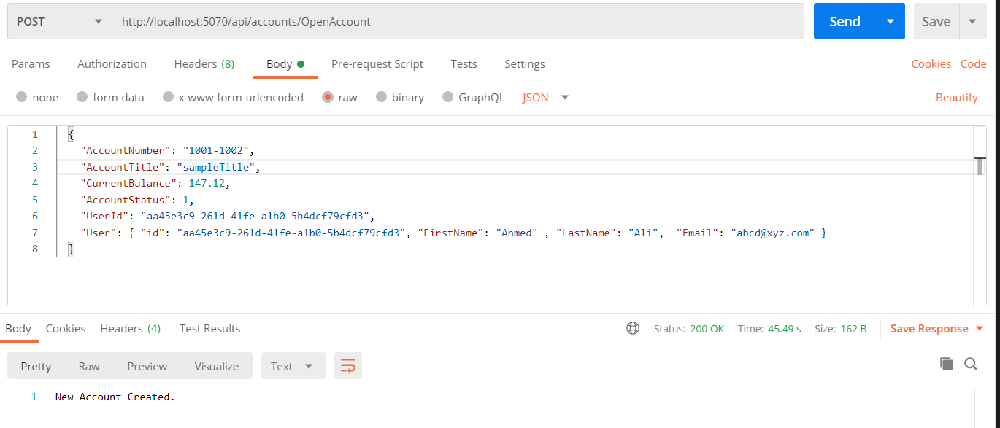

# **Server Side Validation with AutoMapper**

## **What Is Server Side Validation?**
Server-side validation indicates that any input sent by the user (or client) cannot be trusted. Server-side validation helps **prevent users from bypassing validation** by disabling or changing the client script. 

## **Server Side Validation in Asp.Net Core**
In Asp.Net Core, the server-side validation also known as **Model Validation**. Asp.Net Core validates the model with the constraints applied by validation attributes annotated on the top of each property of our model. These **validation attributes are known as Data Annotation**. The **ModelState** property checks whether the data is valid with respect to the annotation applied or not and ModelState.IsValid returns true if it's valid, false otherwise. 
We will see the implementation in this lab

**ModelState** is a property of a Controller instance, and can be accessed from any class that inherits from Controller Class. The ModelState has two purposes: to store and submit POSTed name-value pairs, and to store the validation errors associated with each value

The **Data Annotations** is a namespace that provides attribute classes, and these classes define metadata for controls for validation. Following is the list of built-in attributes 

## **Built-in attributes**
Here are some of the built-in validation attributes:

* **[ValidateNever]:** Indicates that a property or parameter should be excluded from validation.
* **[CreditCard]:** Validates that the property has a credit card format. Requires jQuery Validation Additional Methods.
* **[Compare]:** Validates that two properties in a model match.
* **[EmailAddress]:** Validates that the property has an email format.
* **[Phone]:** Validates that the property has a telephone number format.
* **[Range]:** Validates that the property value falls within a specified range.
* **[RegularExpression]:** Validates that the property value matches a specified regular expression.
* **[Required]:** Validates that the field isn't null. 
* **[StringLength]:** Validates that a string property value doesn't exceed a specified length limit.
* **[Url]:** Validates that the property has a URL format.
* **[Remote]:** Validates input on the client by calling an action method on the server. 
  
A complete list of validation attributes can be found in the `System.ComponentModel.DataAnnotations` namespace.

Click [here](https://docs.microsoft.com/en-us/aspnet/core/mvc/models/validation?view=aspnetcore-6.0) to learn more about these attributes in detail 

## **AutoMapper**
AutoMapper is a simple library that helps us to transform one object type to another. It is a convention-based object-to-object mapper that requires very little configuration. The object-to-object mapping works by transforming an input object of one type into an output object of a different type.

## **Case Study**
Consider a bank application where an admin has the access to open an account for a user. If we have only client-side validation applied in our form, the application can easily be breached with some simple tricks and tools and modify the sensitive information. Here the magic of server-side validation prevents us from such scenarios which validates the data first with the constraints set by the application. 

**Note:** click HERE to visit our lab on client-side validation  

We will implement a server side validation using AutoMapper for the above case study    

---------------

## About this exercise
In this lab we will be working on two code Bases, **Backend Code base** and **Frontend Code Base**. We will use our **AngularForms lab as a starting point** for this lab

## **Backend Code Base**
### Previously 
We developed a base structure of an API solution in Asp.net core that have just two controllers which are `TransactionController` and `AccountController`.

* `TransactionController` have api functions `GetLast12MonthBalances` and `GetLast12MonthBalances/{userId}` which returns data for the last 12 months total balances.
* `AccountController` have api function `OpenAccount(Account account)` which is used to create an account for the user

There are 4 Projects in the solution. 

*	**Entities** : This project **contains DB models** like User where each User has one Account and each Account can have one or many Transactions. There is also a Response Model of LineGraphData that will be returned as API Response. 

*	**Infrastructure**: This project **contains BBBankContext** that service as fake DBContext that populates one User with its corresponding Account that has three Transactions dated of last three months with hardcoded data. 

* **Services**: This project **contains TransactionService** with the logic of converting Transactions into LineGraphData after fetching them from BBBankContext.

* **BBBankAPI**: This project **contains TransactionController** with 2 GET methods `GetLast12MonthBalances` & `GetLast12MonthBalances/{userId}` to call the TransactionService.


For more details about this base project See: https://github.com/PatternsTechGit/PT_AngularForms

-----------

## **Frontend Code Base**
 From the previous lab, we have a simple form to  open a new account  for a user but we don't have any front-end side for this lab,  we will only **use the Postman to make a  HTTP request** to open an account for the user.

  Click [here](https://www.postman.com/downloads/) to install the Postman 

_____________

## **In this exercise**

**Backend Code**
* Create `AccountRequestDTO.cs` and **add data annotations** on the properties  
* Add [ValidateNever] annotation **on the Id Property** of `BaseEntity.cs` file 
* Change the **connectionString**  
* Run **migration commands** to create a new database  
* Install **AutoMapper** from nuget package manager console
* Create a **mapping profile** 
* Add **mapper configuration** in the `Program.cs` file 
* Update the `AccountService.cs` file  and its contract 
* Update the `AccountsController.cs` file 
* **HTTP Calling for the OpenAccount**

## **Backend Implementation**
Follow the below steps to implement backend code for Server Side validation with AutoMapper

### **Step 1: Create an Account Request DTO with Validations on the Properties**

 **Create a new folder RequestDTO** in the Entities project of the solution project. **Create a new file** `AccountRequestDTO.cs` inside this folder  which will acts as a DTO to open the account for a user. 
 
 ### **What is a DTO?**
A DTO (Data Transfer Object) **defines part or all of data defined by the underlying Domain object**. Note that data from different domain objects can be represented in a single DTO, that's actually one of the major benefits for having DTO.

 The code for this DTO is given below.
 ```cs
    public class AccountRequestDTO
    {
        [MinLength(4, ErrorMessage = "The AccountNumber value cannot less than 4 characters. ")]
        [MaxLength(9, ErrorMessage = "The AccountNumber value cannot exceed 9 characters. ")]
        [Required(ErrorMessage = "AccountNumber is required.")]
        public string AccountNumber { get; set; }

        [MinLength(4, ErrorMessage = "The AccountTitle value cannot less than 4 characters.")]
        [MaxLength(20, ErrorMessage = "The AccountTitle value cannot exceed 20 characters. ")]
        [Required(ErrorMessage = "AccountTitle is required.")]
        public string AccountTitle { get; set; }
        
        [Required(ErrorMessage = "CurrentBalance is required.")]
        [Range(0, double.MaxValue, ErrorMessage = "CurrentBalance cannot be negative")]
        public decimal CurrentBalance { get; set; }
        
        [Required(ErrorMessage = "AccountStatus is required.")]
        public AccountStatus AccountStatus { get; set; }
        
        [Required(ErrorMessage = "UserId is required.")]
        public string UserId { get; set; }
        
        public virtual User User { get; set; }
    }
 ```
we have multiple annotations defined  for the properties  in which the validations are required. 

## Step 2: **Add [ValidateNever] annotation in the `BaseEntity.cs` file** 
Add a [ValidateNever] annotation **on the Id Property** of `BaseEntity.cs` file so that the Id property must should not be included in the migration process dor the database. 
The updated `BaseEntity.cs` file looks like this 
```cs
    public class BaseEntity
    {
        [ValidateNever]
        [Key] // Unique Key for entity in database
        public string Id { get; set; }
    }
```

## Step 3: **Change the Connection String**
In the `appSettings.Json` file,  **replace the connection string** with a given line. Here, **the Dot represents the local machine** and the **BBBankDB is the database name**
```cs
"BBBankDBConnString": "Server=.;Initial Catalog=BBBankDB;Trusted_Connection=True"
```
The `appSettings.Json` file will looks like this 
```cs
{
  "Logging": {
    "LogLevel": {
      "Default": "Information",
      "Microsoft.AspNetCore": "Warning"
    }
  },
  "AllowedHosts": "*",
  "ConnectionStrings": {
    "BBBankDBConnString": "Server=.;Initial Catalog=BBBankDB;Trusted_Connection=True"
  }
}
```
## Step 4: **Run Migrations**
Migration is a way to keep the database schema in sync with the EF Core model by preserving data. Run the migration commands to sync our entities with the database. 
Follow the steps below to run the migration in Aso.Net Core

### Step 1: **Create a Database**
Create a new database **BBBankDB** in the SQL Server Management Studio by right clicking on the Databases folder.

### Step 2: **Open the Package Manager Consol**
Open the Package Manager Consol By clicking on the **Tools** in the menu bar, select **Nuget Package Manager** and than select **Package Manager Consol**. A console would appear like in the image shown below where you may run the migration commands. Select the **Infrastructure Project** as the default project in the NPM consol  


### Step 3: **Add the Migration**
Run the given migration command in the NPM console which will automatically add a new migration file in the **Migrations** folder inside the **Infrastructure Project** 
```cs
add-migration InitialMigration
```
### Step 4: **Update the Database**
Run the given migration command in the NPM Console which will automatically update the database described in the connection string.
```cs
Update-Database
```
You may view your changing on the database side that you made on the entities. For more about the **entity framework migration on the ASP.Net Core 6** read the documentation by clicking the link below 
[migration](https://docs.microsoft.com/en-us/ef/core/managing-schemas/migrations/)

## Step 5: **AutoMapper**
Follow the steps below to work with the **AutoMapper** 

### Step 1: **Install the AutoMapper**
Install **AutoMapper** from nuget package manager console. First right click the **Service Project** and select  **Manage Nuget Packages**. Search **AutoMapper** and  click on the install button 

### Step 2: **Create a Mapping Profile**
Create a new file `MappingProfiles.cs` in the **BBBankAPI project** where we will describe the mapping profiles of our entities and DTOs.
The code for this file is given below
```cs
using AutoMapper;
using Entities;
using Entities.RequestDTO;

namespace BBBankAPI
{
    public class MappingProfiles : Profile
    {
        public MappingProfiles()
        {
            CreateMap<AccountRequestDTO, Account>();

        }
    }
}
```
### Step 3: **Add Mapping Configuration**
Add **mapping configuration** in the `Program.cs` file, where we will set the `MappingProfiles.cs` file as a profile in the configuration and will add this configuration as a singleton service to be access in the pipeline 
The code is given below  
 ```cs
    var mapperConfig = new MapperConfiguration(mc =>
    {
        mc.AddProfile(new MappingProfiles());
    });

    IMapper mapper = mapperConfig.CreateMapper();
    builder.Services.AddSingleton(mapper);
```

## Step 6: **Account Service**
Follow the steps below to update the account service

### Step 1: **Update the Account Service Contract**
First we need to update the account service contract `IAccountService.cs` openAccount method like given below
```cs
  public interface IAccountsService
    {
        Task OpenAccount(AccountRequestDTO account);
    }
```
### Step 2: **Update the Account Service**
Now, we need to update the account service `AccountService.cs` where we will first, inject the **IMapper** in the constructor as a **Dependency Injection** and also update the openAccount method 
The `AccountService.cs` will looks like this

```cs
    public class AccountService : IAccountsService
    {
        private readonly BBBankContext _bbBankContext;
        private readonly IMapper _mapper;

        public AccountService(BBBankContext BBBankContext, IMapper mapper)
        {
            _mapper = mapper;
            _bbBankContext = BBBankContext;
        }

        public async Task OpenAccount(AccountRequestDTO accountRequest)
        {
            // If the user with the same User ID is already in teh system we simply set the userId forign Key of Account with it else 
            // first we create that user and then use it's ID.
            var user = await _bbBankContext.Users.FirstOrDefaultAsync(x => x.Id == accountRequest.User.Id);
            if (user == null)
            {
                //  await _bbBankContext.Users.AddAsync(accountRequest.User);
                accountRequest.UserId = accountRequest.User.Id;
            }
            else
            {
                accountRequest.UserId = user.Id;
            }

            var account = _mapper.Map<Account>(accountRequest);

            // Setting up ID of new incoming Account to be created.
            account.Id = Guid.NewGuid().ToString();
            // Once User ID forigen key and Account ID Primary Key is set we add the new accoun in Accounts.
            await this._bbBankContext.Accounts.AddAsync(account);
            // Once everything in place we make the Database call.
            await this._bbBankContext.SaveChangesAsync();
        }
    }
```

## Step 7: **Update the Accounts Controller**
Update the `AccountsController.cs` file openAccount method where we have used the ModelState.IsValid property to check the server side validation as we applied data annotation on the DTO, The account will e created if the validation are passed otherwise it will give us the bad request as a response 
The code is given below
```cs
[HttpPost]
        [Route("OpenAccount")]
        public async Task<ActionResult> OpenAccount(AccountRequestDTO accountRequest)
        {
            try
            {
                if (ModelState.IsValid)
                {
                    await _accountsService.OpenAccount(accountRequest);
                    return new OkObjectResult("New Account Created.");
                }
                else
                {
                    return new BadRequestObjectResult(ModelState.Values);
                }
            }
            catch (Exception ex)
            {
                return new BadRequestObjectResult(ex);
            }
        }
``` 
## Step 7: **HTTP Calling for the OpenAccount**
We will use the Postman to make a HTTP hit on the OpenAccount as a endpoint in our controller
Use the following 
* **URL:** http://localhost:5070/api/accounts/OpenAccount
* **Body:** 
```json
  {
    "AccountNumber": "1001-1002",
    "AccountTitle": "sampleTitle",
    "CurrentBalance": 147.12,
    "AccountStatus": 1,
    "UserId": "aa45e3c9-261d-41fe-a1b0-5b4dcf79cfd3",
    "User": { "id": "test", "email": "abcd@xyz.com" }
  }
```
If the values passed are correct and the validations are passed the following response would be




And if the values passed are incorrect and the validations are failed the following response would be


